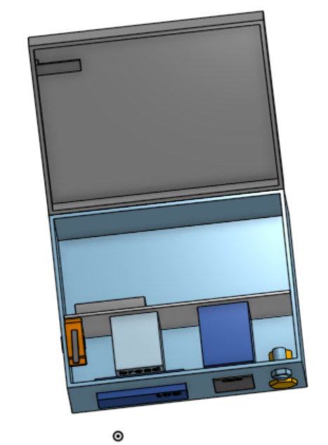

# Keypad and Fingerprint Safe
My project is a keypad and fingerprint ID safe. The box has a keypad and fingerprint scanner on it. After the person correctly puts in the password and fingerprint, the box will open and they will be able to retrieve their belongings. Otherwise, the box will remain locked.


| **Engineer** | **School** | **Area of Interest** | **Grade** |
|:--:|:--:|:--:|:--:|
| Grace W | Prospect High School | Mechanincal Engineering | Incoming Senior | 

<div align="center">

</div>

# Final Milestone

<iframe width="560" height="315" src="https://www.youtube.com/embed/s2chDWI1hzg?si=o6awmSPj3lgRzjfN" title="YouTube video player" frameborder="0" allow="accelerometer; autoplay; clipboard-write; encrypted-media; gyroscope; picture-in-picture; web-share" referrerpolicy="strict-origin-when-cross-origin" allowfullscreen></iframe>

For my final milestone, I packaged all of the components that I had wired up and coded in the previous milestone into the box and added a locking mechanism to make it a functional safe. To have the lcd display, keypad, scanner, and buttons accessible, I cut openings in the box and used screws to mount them in place. I also CAD-ed a 3D printed mount for the servo so that I could mount it to the side more securely. <br>
One of the biggest challenges that I faced when doing this was figuring out the spacing of all of the components so that I could fit everthing neatly inside of the box while still having room to put other things inside of the box. To solve this, I created a CAD of the box and all of the components to figure out the spacing. In this CAD, I decided to use a fake wall to mount the Arduino, breadboard, and battery. The wires also took up a lot of room and got very tangled and confusing so I used tape and zipties to group them based on function and mount them to the sides of the box to make it neater. 
One other challenge that I faced was the strength of the locking mechanism. I started out making it from cardboard but it broke really easily. To address that I remade it using a 3D printed part but that also broke after a few uses. Finally, I attached a metal gusset to increase the durability of the locking mechanism. <br>
Some key topics that I learned from this project have been how to code sensors and mechanisms using Arduino IDE, some basic electrical, fabrication using tools like the dremel, and CAD. In the future, I hope to learn more about mechanical design, specifically CAD, and electronics and add on the nerf gun modification that I ran out of time for here. 

# CAD

<br>
**Figure #1 - Front View**
<br>

<br>
**Figure #2 - Inside View**
<br>

<br>
**Figure #3 - Locking Mechanism**

# Flowchart

**Figure #4 - Flowchart**

# Code
<!--- Here's where you'll put your code. The syntax below places it into a block of code. Follow the guide [here]([url](https://www.markdownguide.org/extended-syntax/)) to learn how to customize it to your project needs. -->

```c++
#include <Servo.h>
#include <Keypad.h>
#include <Adafruit_Fingerprint.h>
#include <LiquidCrystal_I2C.h>

Servo myServo;
int pos = 0;
String input = "";
String password = "1234";
int attempts = 0;
const int buzzer = 6;

int button = digitalRead(5);

//keypad button mapping
const byte ROWS = 4;  //four rows
const byte COLS = 3;  //three columns
char keys[ROWS][COLS] = {
  { '1', '2', '3' },
  { '4', '5', '6' },
  { '7', '8', '9' },
  { '*', '0', '#' }
};
byte rowPins[ROWS] = { 10, 11, 12, 13 };  //connect to the row pinouts of the keypad
byte colPins[COLS] = { 7, 8, 9 };         //connect to the column pinouts of the keypad

//Create an object of keypad
Keypad keypad = Keypad(makeKeymap(keys), rowPins, colPins, ROWS, COLS);

// Define a Fingerprint sensor on pins 3 & 4
SoftwareSerial mySerial(4, 3);
Adafruit_Fingerprint finger = Adafruit_Fingerprint(&mySerial);

//create a liquid crystal object for lcd screen
LiquidCrystal_I2C lcd(0x27, 16, 2);

void setup() {
  Serial.begin(9600);

  myServo.attach(2);  // attaches the servo on pin 2 to the servo object
  myServo.write(pos);
  
  //lcd stuff
  lcd.init();
  lcd.backlight();

  //lock button stuff
  pinMode(5, INPUT);

  //buzzer on pin 6
  pinMode(buzzer, OUTPUT);
  
  intro();

  // Connect to the sensor
  finger.begin(57600);
  if (finger.verifyPassword()) {
    Serial.println("Found fingerprint sensor!");
  } else {
    Serial.println("Did not find fingerprint sensor :(");
    while (1);
  }
}

void loop() {
  char key = keypad.getKey();  //return key number
  if (key == '*') {
    input = "";
    Serial.println("Cleared");
    lcd.clear();
    lcd.print("Cleared");
  } else if (key) {
    if (input.length() == 4) {
      if (password.equals(input)) {
        lcd.clear();
        Serial.println("Correct! Please scan your finger now");
        lcd.setCursor(1,0);
        lcd.print("Correct!");
        lcd.setCursor(1, 1);
        lcd.print("Scan finger now");

        finger.LEDcontrol(FINGERPRINT_LED_GRADUAL_ON, 0, FINGERPRINT_LED_PURPLE);
        input = "";
        delay(4000);
        int fID = getFingerprintID();
        if (fID > 0) {
          Serial.println("Fingerprint Identified");
          lcd.clear();
          lcd.setCursor(4, 1);
          lcd.print("Fingerprint");
          lcd.setCursor(4, 2);
          lcd.print("Identified!");
          delay(2000);
          lcd.clear();
          lcd.setCursor(2, 1);
          lcd.print("Will now unlock");
          moveLock(false);
            
          lcd.clear();
          lcd.setCursor(1, 0);
          lcd.print("Press red button");
          lcd.setCursor(1,1);
          lcd.print("to lock the box");
          delay(1000);
          int current = millis();
          for(int i = current; i < current + 5000; i++){
            button = digitalRead(5);
            Serial.println(button);   
            if(button == HIGH){
              lcd.clear();
              lcd.print("Locking");
              moveLock(true);
              break;
            }
          }

          delay(1000);
          intro();
        }
        else if (fID == -2){
          Serial.println("Unknown fingerprint. Access Denied :[");
          lcd.clear();
          lcd.setCursor(1, 0);
          lcd.print("Unknown fingerprint");
          lcd.setCursor(1, 1);
          lcd.print("Access Denied :[");

          finger.LEDcontrol(FINGERPRINT_LED_BREATHING, 10, FINGERPRINT_LED_RED);
          delay(2000);
          finger.LEDcontrol(FINGERPRINT_LED_GRADUAL_OFF, 0, FINGERPRINT_LED_RED);
        }
        else { 
          Serial.println("Fingerprint not found. Please input password again.");
          lcd.clear();
          lcd.setCursor(0, 0);
          lcd.print("Fingerprint not seen");
          lcd.setCursor(1, 1);
          lcd.print("Re-input password");
          
          finger.LEDcontrol(FINGERPRINT_LED_BREATHING, 10, FINGERPRINT_LED_PURPLE);
          delay(2000);
          finger.LEDcontrol(FINGERPRINT_LED_GRADUAL_OFF, 0, FINGERPRINT_LED_PURPLE);
        }
      }
      else {
        Serial.println("Incorrect! Try again");
        lcd.clear();
        lcd.setCursor(0, 0);
        lcd.print("Incorrect!");
        lcd.setCursor(1, 1);

        attempts++;
        int left = 5 - attempts;
        lcd.print(left);
        lcd.print(" attempts left");

        input = "";
        finger.LEDcontrol(FINGERPRINT_LED_BREATHING, 10, FINGERPRINT_LED_RED);
        delay(2000);
        finger.LEDcontrol(FINGERPRINT_LED_GRADUAL_OFF, 0, FINGERPRINT_LED_RED);

        if(attempts == 5){
          int current = millis();
          for(int i = current; i < current + 10; i++){
            Serial.println(i);
            lcd.clear();
            lcd.print("Thief! Go away >:<");
            tone(buzzer, 4000); // Send 1KHz sound signal...
            delay(1000);        // ...for 1 sec
            noTone(buzzer);     // Stop sound...
            delay(1000);        // ...for 1sec
          }
          noTone(buzzer);
        }
      }
    } else {
      input += key;
      Serial.println(input);
      delay(50);
      lcd.clear();
      lcd.print(input);
    }
  }
}

void intro(){
  lcd.clear();
  Serial.println("Please put in the correct password. Press # when done");
  lcd.setCursor(1,0);
  lcd.print("Please enter the");
  lcd.setCursor(1, 1);
  lcd.print("correct password");
  lcd.setCursor(1, 2);
  lcd.print("Press # to enter");
}

void moveLock(boolean lock){
  Serial.println("Lock moving");
  finger.LEDcontrol(FINGERPRINT_LED_BREATHING, 10, FINGERPRINT_LED_BLUE);
  delay(2000);
  finger.LEDcontrol(FINGERPRINT_LED_GRADUAL_OFF, 0, FINGERPRINT_LED_BLUE);

  if (lock == false) {
    for (pos = 0; pos < 90; pos += 3) {  // goes from 0 degrees to 180 degrees
      myServo.write(pos);  // tell servo to go to position in variable 'pos'
      delay(15);           // waits 15ms for the servo to reach the position
    }
  } else if (lock == true) {
    for (pos = 90; pos > 0; pos -= 3) {  // goes from 0 degrees to 180 degrees
      // in steps of 1 degree
      myServo.write(pos);  // tell servo to go to position in variable 'pos'
      delay(15);           // waits 15ms for the servo to reach the position
    }
  }
}

//returns the ID of the matching fingerprint or prints the error
int getFingerprintID() {
  uint8_t p = finger.getImage();
  switch (p) {
    case FINGERPRINT_OK:
      Serial.println("Image taken");
      break;
    case FINGERPRINT_NOFINGER:
      Serial.println("No finger detected");
      return -1;
    case FINGERPRINT_PACKETRECIEVEERR:
      Serial.println("Communication error");
      return -1;
    case FINGERPRINT_IMAGEFAIL:
      Serial.println("Imaging error");
      return -1;
    default:
      Serial.println("Unknown error");
      return -1;
  }

  // OK success!
  p = finger.image2Tz();
  switch (p) {
    case FINGERPRINT_OK:
      Serial.println("Image converted");
      break;
    case FINGERPRINT_IMAGEMESS:
      Serial.println("Image too messy");
      return -1;
    case FINGERPRINT_PACKETRECIEVEERR:
      Serial.println("Communication error");
      return -1;
    case FINGERPRINT_FEATUREFAIL:
      Serial.println("Could not find fingerprint features");
      return -1;
    case FINGERPRINT_INVALIDIMAGE:
      Serial.println("Could not find fingerprint features");
      return -1;
    default:
      Serial.println("Unknown error");
      return -1;
  }

  // OK converted!
  p = finger.fingerSearch();
  if (p == FINGERPRINT_OK) {
    Serial.println("Found a print match!");
  } else if (p == FINGERPRINT_PACKETRECIEVEERR) {
    Serial.println("Communication error");
    return -1;
  } else if (p == FINGERPRINT_NOTFOUND) {
    Serial.println("Did not find a match");
    return -2;
  } else {
    Serial.println("Unknown error");
    return -1;
  }

  // found a match!
  Serial.print("Found ID #");
  Serial.print(finger.fingerID);
  Serial.print(" with confidence of ");
  Serial.println(finger.confidence);
  return finger.fingerID;
}
```

# Second Milestone

<iframe width="560" height="315" src="https://www.youtube.com/embed/-lhDAlV7QI4?si=5ZCQV8xxpAzb_-GX" title="YouTube video player" frameborder="0" allow="accelerometer; autoplay; clipboard-write; encrypted-media; gyroscope; picture-in-picture; web-share" referrerpolicy="strict-origin-when-cross-origin" allowfullscreen></iframe>

For my second milestone, I finished up the "guts" of my safe by doing all of the all of the wiring and coding for all of the components that I planned on using (servo, LCD display, fingerprint scanner, button, on-off switch, keypad). I wired them using jumper wires to a breadboard and the arduino. In Arduino IDE, I used a bunch of if statements and installed the libraries needed to use my componenets to create the locking code. I used the soldering iron to connect wires to create extensions and attach solid core wire so that I could insert it into the breadboard without individual wire strands breaking inside and messing things up. Some challenges that I faced were the button and on-off switch. At first,the button would give the wrong data and take a long amount of time to change its output after being pressed. To fix this, I removed the delay that I added after it and it was able to give correct data with minimum lag. For the on-off switch, I messed up the solder joints connecting the battery and the switch, preventing the rest of the circuit from recieving enough voltage. To fix this, I redid all of the solder joints, fixing the issue. To complete my final milestone, I need to package all of the components that I have wired up and coded into the box.

# Schematics 

**Figure #5 - Keypad Wiring (credit: Adafruit Learning Center)**


**Figure #6 - Button Wiring (credit: The Chewett blog)**


**Figure #7 - LCD Display Wiring (credit: Makerguides)**


**Figure #8 - Servo Wiring (credit: Build Electronic Circuits)**

# First Milestone
<iframe width="560" height="315" src="https://www.youtube.com/embed/wYVMw6ThgyI?si=PYWWjNdsai_RXagc" title="YouTube video player" frameborder="0" allow="accelerometer; autoplay; clipboard-write; encrypted-media; gyroscope; picture-in-picture; web-share" referrerpolicy="strict-origin-when-cross-origin" allowfullscreen></iframe>

For my first milestone, I wired up the keypad and servo onto the arduino. I Arduino IDE on my computer to upload code. I mapped the button "1" to make the servo move 180 degrees clockwise and "2" to make the servo move 180 degrees counterclockwise so that the servo would spin accordingly when the respective buttons on the keypad were pressed. I also made the computer print out the value of whatever button I pressed. Some challeges that I faced were how much the arduino could handle. At first, I had the servo just constantly spinning, which made the keypad stop working whenever the servo was active. It also kept forcing my computer to shut down. To fix this, I added a battery pack to provide more power so that the arduino wouldn't have to only draw power from the computer and made the servo only spin a set amount when a button was clicked.

# Bill of Materials
<!--- Here's where you'll list the parts in your project. To add more rows, just copy and paste the example rows below.
Don't forget to place the link of where to buy each component inside the quotation marks in the corresponding row after href =. Follow the guide [here]([url](https://www.markdownguide.org/extended-syntax/)) to learn how to customize this to your project needs. -->

| **Part** | **Note** | **Price** | **Link** |
|:--:|:--:|:--:|:--:|
| Arduino | Used to relay code to the devices attached to the arduino | $27.60 | <a href="https://www.amazon.com/Arduino-A000066-ARDUINO-UNO-R3/dp/B008GRTSV6/"> Link </a> |
| Wooden Box | Used as the main body of the safe to hold all of the components | $17.88 | <a href="https://www.amazon.com/10-8x7x8x5-7-Inch-Unfinished-Project-Woodcraft-Keepsake/dp/B09TP79KMG/ref=asc_df_B09TP79KMG/?tag=hyprod-20&linkCode=df0&hvadid=693702993503&hvpos=&hvnetw=g&hvrand=7855882896698640904&hvpone=&hvptwo=&hvqmt=&hvdev=c&hvdvcmdl=&hvlocint=&hvlocphy=9032171&hvtargid=pla-1656049679726&mcid=09c514aa5dc832cf9e480c008ff2ccf2&gad_source=1&th=1"> Link </a> |
| Servo Motor | Used to lock the box | $4.25 | <a href="https://www.amazon.com/Control-Angle180-Digital-Torque-Helicopter/dp/B07NQJ1VZ2"> Link </a> |
| Keypad | Used to input the values pressed by the user | $4.95 | <a href= "https://www.digikey.com/en/products/detail/sparkfun-electronics/COM-14662/8702491?utm_adgroup=&utm_source=google&utm_medium=cpc&utm_campaign=PMax%20Shopping_Product_Low%20ROAS%20Categories&utm_term=&utm_content=&utm_id=go_cmp-20243063506_adg-_ad-__dev-c_ext-_prd-8702491_sig-CjwKCAjwg8qzBhAoEiwAWagLrBAjV71gNMRh6gSqnwGcmKKZgxfZONfA__3vwEc5cEfz6mZHZPNaxhoCMo0QAvD_BwE&gad_source=4&gclid=CjwKCAjwg8qzBhAoEiwAWagLrBAjV71gNMRh6gSqnwGcmKKZgxfZONfA__3vwEc5cEfz6mZHZPNaxhoCMo0QAvD_BwE"> Link </a> |
| Fingerprint scanner | Used to scan the user's fingerprint | $39.95 | <a href="https://www.adafruit.com/product/4651"> Link </a> |
| LCD display | Used to display the user's input and other messages | $5.99 | <a href="https://www.elecbee.com/en-29832-IIC-I2C-1602-Blue-Backlight-LCD-Display-Screen-Module-for-Arduino-products-that-work-with-official-Arduino-boards?utm_term=&utm_campaign=shopping_%E7%BE%8E%E5%9B%BD2021/03/05&utm_source=adwords&utm_medium=ppc&hsa_acc=9958698819&hsa_cam=12473735731&hsa_grp=115457242501&hsa_ad=502747062194&hsa_src=g&hsa_tgt=pla-294682000766&hsa_kw=&hsa_mt=&hsa_net=adwords&hsa_ver=3&gad_source=1&gclid=CjwKCAjwg8qzBhAoEiwAWagLrDYhfhUbbYnmmnm0Mdn34YCLbcvGuJFkkJEgVpdvvIMMb6UYsUD3EBoCIRcQAvD_BwE"> Link </a> |
| Battery pack | Used to hold batteries | $0.99 | <a href="https://www.aliexpress.us/item/2255800085048686.html?src=google&src=google&albch=shopping&acnt=708-803-3821&slnk=&plac=&mtctp=&albbt=Google_7_shopping&gclsrc=aw.ds&albagn=888888&isSmbAutoCall=false&needSmbHouyi=false&src=google&albch=shopping&acnt=708-803-3821&slnk=&plac=&mtctp=&albbt=Google_7_shopping&gclsrc=aw.ds&albagn=888888&ds_e_adid=&ds_e_matchtype=&ds_e_device=c&ds_e_network=x&ds_e_product_group_id=&ds_e_product_id=en2255800085048686&ds_e_product_merchant_id=109226772&ds_e_product_country=US&ds_e_product_language=en&ds_e_product_channel=online&ds_e_product_store_id=&ds_url_v=2&albcp=19158444193&albag=&isSmbAutoCall=false&needSmbHouyi=false&gad_source=1&gclid=CjwKCAjwg8qzBhAoEiwAWagLrOpaej3k4efkp4YyWvfM8vmhTXSb_L1wvrkKTOeJnbjJjQ0pbtrG2xoCsD4QAvD_BwE&aff_fcid=c304c687bdc3452d9a6329fe3798d70d-1718824126454-00553-UneMJZVf&aff_fsk=UneMJZVf&aff_platform=aaf&sk=UneMJZVf&aff_trace_key=c304c687bdc3452d9a6329fe3798d70d-1718824126454-00553-UneMJZVf&terminal_id=404226348af640d894c68bcc06778bd1&afSmartRedirect=y&gatewayAdapt=glo2usa"> Link </a> |
| Batteries | Used to power the safe | $14.89 | <a href="https://www.amazon.com/Coppertop-Batteries-Ingredients-Long-lasting-Household/dp/B002UXRXE6/ref=asc_df_B002UXRXE6/?tag=hyprod-20&linkCode=df0&hvadid=693464962511&hvpos=&hvnetw=g&hvrand=17727216277919997895&hvpone=&hvptwo=&hvqmt=&hvdev=c&hvdvcmdl=&hvlocint=&hvlocphy=9032171&hvtargid=pla-638867480103&psc=1&mcid=c945774d225c355481b304e5f5b0a960&gad_source=1"> Link </a> |
| Button | Used to lock the box | $0.62 | <a href="https://www.walmart.com/ip/10-x-With-Momentary-Round-Head-Panel-Mount-SPST-2-Pin-Push-Button-Switch/2986283540?wmlspartner=wlpa&selectedSellerId=101230727"> Link </a> |
| On-off Switch | Used to turn off the safe to conserve battery | $0.80 | <a href="https://www.amazon.com/DaierTek-250VAC-Rocker-KCD1-101-Plastic/dp/B07S2QJKTX?source=ps-sl-shoppingads-lpcontext&ref_=fplfs&psc=1&smid=AVZNWT0O79W01"> Link </a> |

# Other Resources/Examples
<!--- One of the best parts about Github is that you can view how other people set up their own work. Here are some past BSE portfolios that are awesome examples. You can view how they set up their portfolio, and you can view their index.md files to understand how they implemented different portfolio components. -->
- [Rushabh's portfolio](https://rushabh-taneja.github.io/blue_stamp_engineering/)
- [Adafruit Biometric Security Box](https://learn.adafruit.com/biometric-security-box/program-and-test)
- [Hackster LCD display](https://www.hackster.io/Hack-star-Arduino/learn-to-use-lcd-1602-i2c-parallel-with-arduino-uno-f73f07)

<!--- To watch the BSE tutorial on how to create a portfolio, click here.-->

# Starter Project
<iframe width="560" height="315" src="https://www.youtube.com/embed/f4P4u2elmVI?si=ZLH9Rz3OYL4tvI35" title="YouTube video player" frameborder="0" allow="accelerometer; autoplay; clipboard-write; encrypted-media; gyroscope; picture-in-picture; web-share" referrerpolicy="strict-origin-when-cross-origin" allowfullscreen></iframe>

My starter project is the Mini Arcade Console. It works by receiving input from buttons being pressed and using that to update the LED displays that make up the screen that shows the game. All of the components (ex. LED displays, buzzer, buttons) are soldered together and connected to a battery pack to provide power. The player can choose between a few different games, such as Tetris or Snake, and the system records the player's score. This project mainly taught me better soldering skills.

